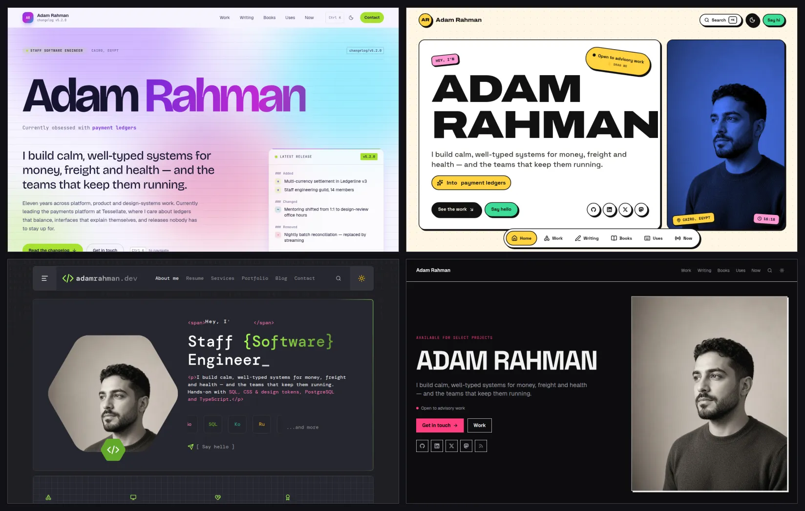
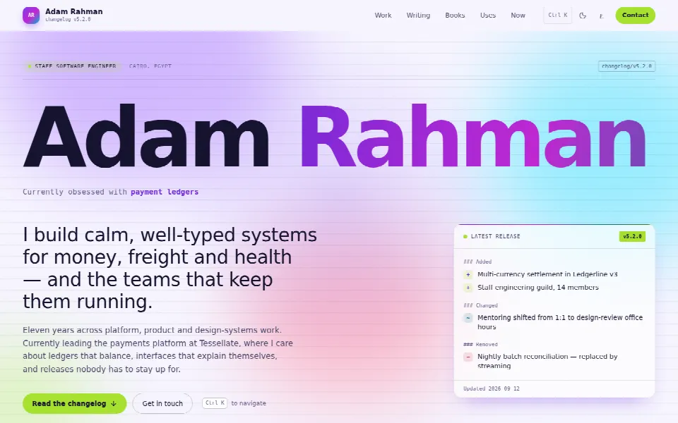
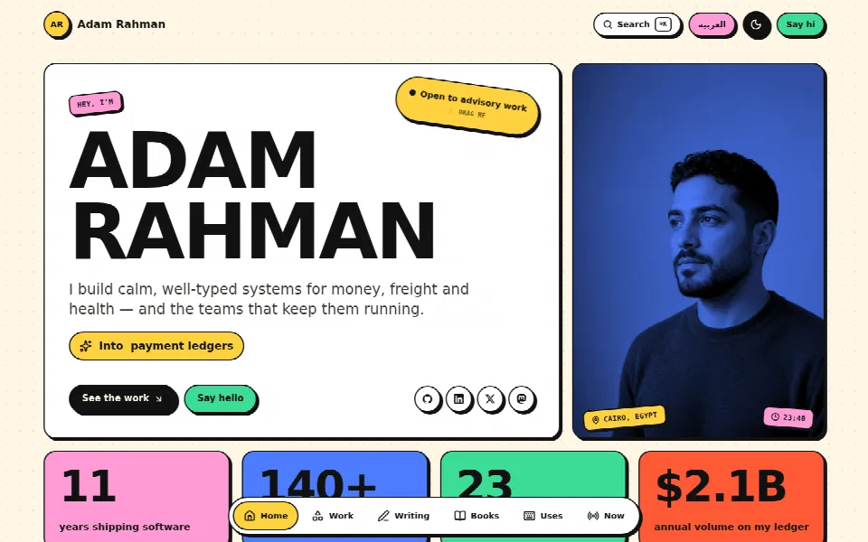
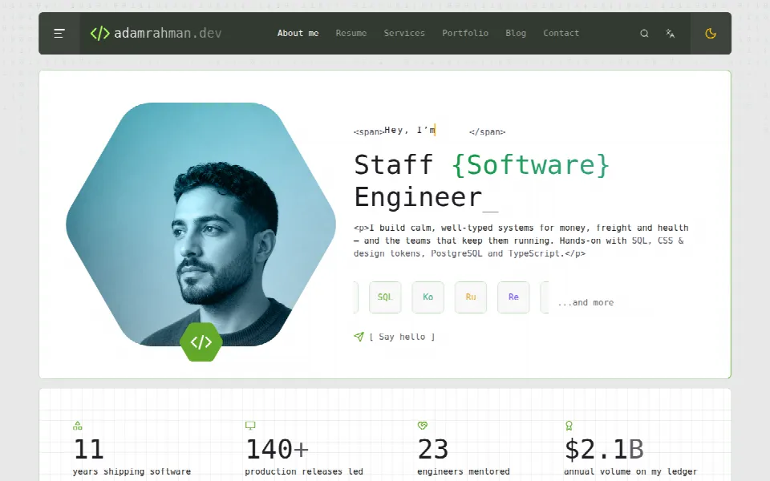
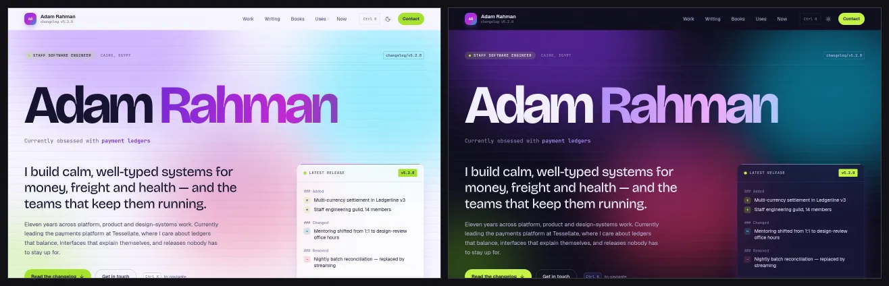
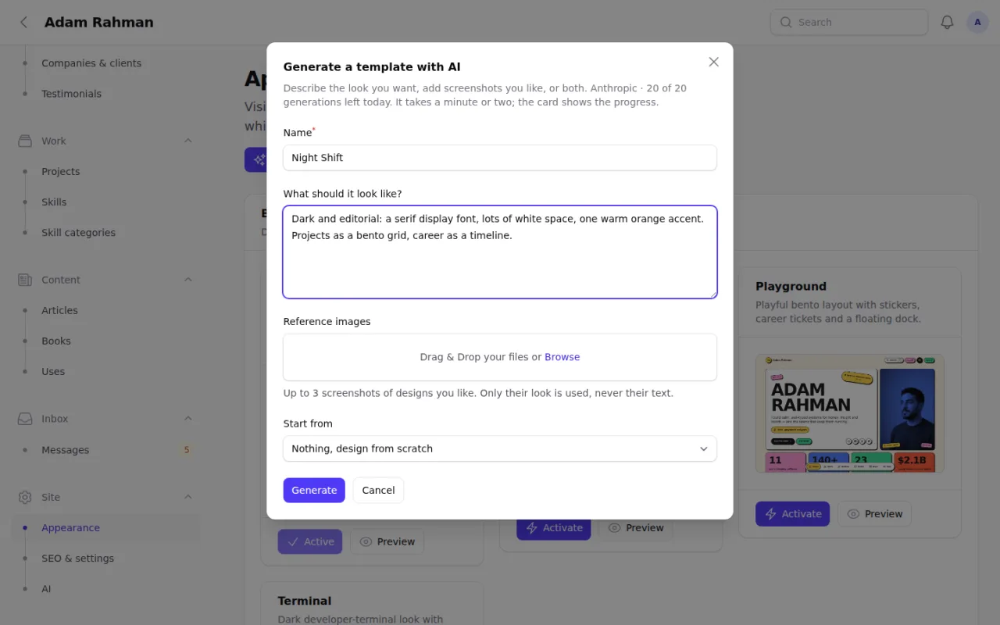
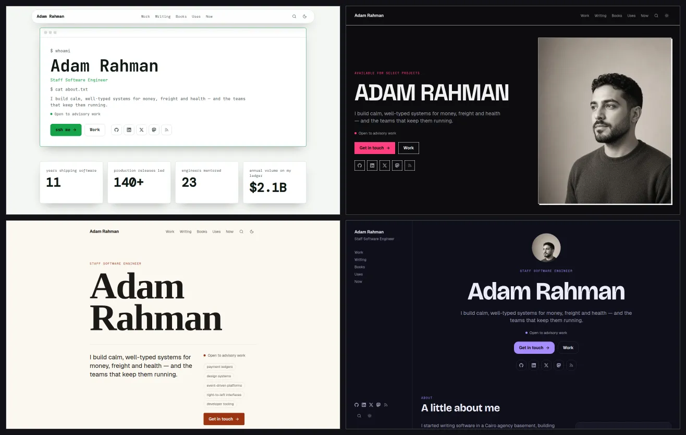
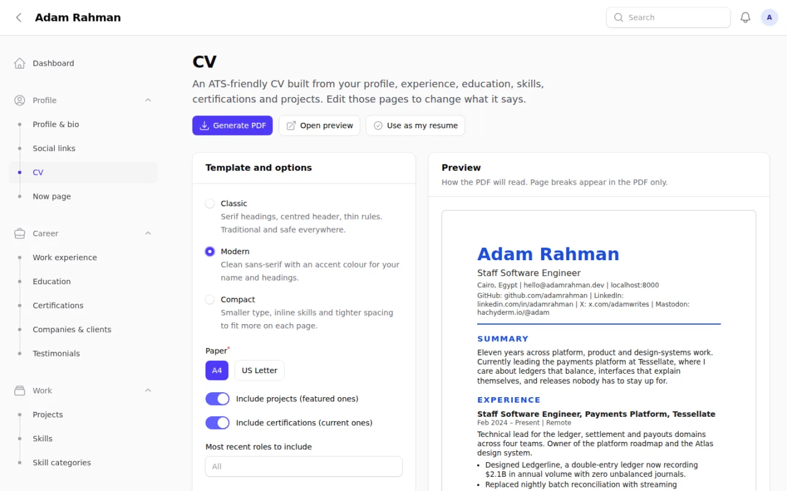
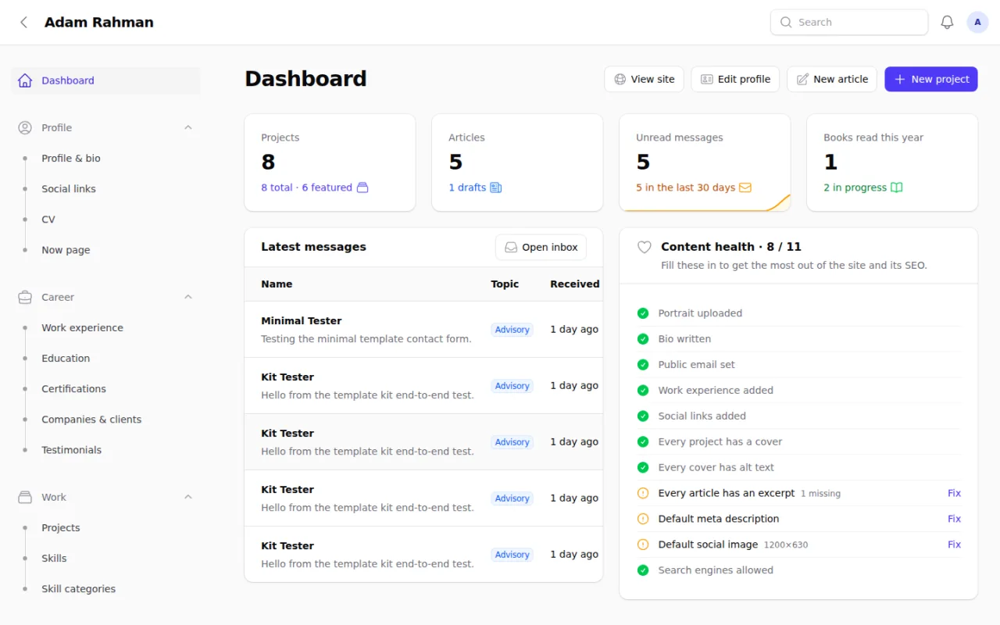
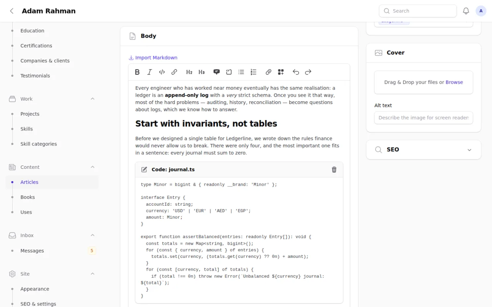

<div align="center">

# Portfolio

### The developer portfolio you run like a CMS, and redesign with one prompt.

A self-hosted Laravel + React portfolio with a real admin panel, swappable
templates, an **AI template builder** and a **one-click ATS-friendly CV**.
Server-rendered, SEO-ready, and yours to extend.

[](https://github.com/MahmoudSlameh/portfolio/actions/workflows/tests.yml)
[](LICENSE)


[Highlights](#-highlights) · [Templates](#-templates) · [AI builder](#-ai-template-builder) ·
[CV](#-ats-friendly-cv-in-one-click) · [Quick start](#-quick-start) ·
[Build a template](#-build-your-own-template) · [Docs](docs/README.md)



**If this saves you a weekend, please ⭐ star the repo. It helps others find it.**

</div>

---

## ✨ Highlights

- 🎨 **Switch the whole design in one click.** Four built-in templates, plus
  your own, all rendering the same content. Preview any of them privately
  before visitors see it.
- 🤖 **Generate new templates with AI.** Describe a look or drop in a
  screenshot; bring any provider (Anthropic, OpenAI, Gemini, Ollama, …). The AI
  writes a validated design spec, never code.
- 📄 **An ATS-friendly CV from your data.** Pick one of three templates and
  download a PDF, or make it the site's "Download CV" file.
- 🛠 **A real admin panel.** Bio, experience, projects, articles, books,
  skills, testimonials, … everything is editable in Filament; nothing
  personal is hard-coded. Paste articles straight from any web page.
- 🚀 **Fast and SEO-first.** Server-side rendering, Open Graph, JSON-LD,
  sitemap, RSS, self-hosted fonts and responsive WebP images.
- 🧩 **Built to be extended.** `php artisan make:template`, a typed template
  contract, a shared kit of hooks, and `template:eject` to turn an AI design
  into React code.
- ✅ **Production-grade.** 450+ Pest tests, Larastan level 7, TypeScript,
  CI on every push, and a full deployment guide.

## 🎨 Templates

| Changelog                                                         | Playground                                                    | Terminal                                                         |
| ----------------------------------------------------------------- | ------------------------------------------------------------- | ---------------------------------------------------------------- |
|             |       |              |
| Editorial "engineer's changelog" with a git-graph career timeline | Playful bento layout with stickers, career tickets and a dock | Dark developer-terminal look with mono type and a project slider |

Plus **Minimal**, a plain, fully commented starter to copy when you build
your own. Every template has a light and a dark theme (no flash on load):



<details>
<summary><b>Every page, in every template</b></summary>

Home, project archive, case studies (architecture diagram, metrics,
gallery), writing archive, articles (table of contents, code blocks),
bookshelf, `/uses`, `/now` and a custom 404. Writing, Books, Uses and Now can
be switched off. There's also a command palette (<kbd>Ctrl</kbd>/<kbd>⌘</kbd> +
<kbd>K</kbd>), archive filters kept in the URL, and a contact form that lands
in the panel's inbox and your email.

Visitors always see the template you activated. While you're signed in,
`/?template=<id>` previews another one just for you (`noindex`), and
`/?template=reset` ends the preview.

</details>

## 🤖 AI template builder

Describe the design you want, attach up to three screenshots you like, and
get a complete new template (every page, light and dark) that renders
**your** real content. It runs in the background; the card on **Site →
Appearance** shows live progress and you get a notification when it's
ready.



**How it stays safe and fast:** the AI never writes code. It fills in a
_Template Spec_: design tokens, layout and section variants, UI copy and an
optional stylesheet. The spec is validated against a schema; if it fails,
the errors go back to the AI to fix (up to twice). The CSS is sanitised,
scoped to the template, and may not load fonts, images or anything else from
the internet. One built-in React engine renders any spec, so generated
templates keep SSR and SEO, need no build step, and survive deploys.



- **Any provider**, via the official [Laravel AI SDK](https://laravel.com/ai):
  Anthropic, OpenAI, Gemini, xAI, Mistral, DeepSeek, Groq, OpenRouter, a
  local Ollama model or any OpenAI-compatible endpoint. Set it in **Site →
  AI** (the key is encrypted and never shown again) with a **Test
  connection** button, or in `.env`.
- **Iterate:** **Refine** ("make it darker, use a serif headline") creates a
  new version; the live site keeps the current one until you activate it.
  **Versions** lets you preview and roll back any version.
- **Edit by hand:** the spec is JSON, editable in the panel with
  validation on save.
- **Share:** export and import templates as `.studio.json` files
  ([guide](docs/templates/sharing-studio-templates.md)).
- **Keep costs predictable:** a daily generation limit, and token usage shown
  on every version.
- **Graduate to code:** `php artisan template:eject "Night Shift" night-shift`
  turns a generated design into a regular React template you own.

Full design: [docs/12-ai-templates.md](docs/12-ai-templates.md).

## 📄 ATS-friendly CV in one click

Your CV is built from the same data as your site, so it's never out of date.
On **Profile → CV**, pick **Classic**, **Modern** or **Compact**, A4 or US
Letter and the sections to include; check the live preview; then **Generate
PDF**, or **Use as my resume** to make it the file behind the site's
"Download CV" link.



The templates follow the rules applicant-tracking systems care about:

- a single column of real, selectable text;
- standard section headings;
- `MMM YYYY` dates;
- no tables, images or icons;
- contact details in the body, not a header or footer.

Tests extract the PDF text and check that it reads in order. Scripting?
`php artisan cv:generate --template=modern --paper=letter`.

## 🛠 The admin panel



<details>
<summary><b>Everything you can manage</b></summary>

- **Profile & bio**, social links, now page, resume/CV.
- **Career:** work experience (with a changelog-style timeline), education,
  certifications, companies & clients, testimonials.
- **Work:** projects with case studies, architecture diagrams, metrics and
  galleries; skills and categories.
- **Content:** articles in a rich editor (paste from any page or Google
  Docs, import Markdown, callouts and code blocks with file names), books,
  uses.
- **Inbox** for contact messages, and a **dashboard** with a content-health
  checklist.
- **Site:** Appearance (templates, AI, versions, import/export), SEO &
  settings (meta defaults, favicon, OG image, verification codes, analytics,
  page toggles), AI provider settings.
- All media go through Spatie Media Library, with responsive WebP
  conversions and alt text.

</details>



## 🚀 Quick start

**Requirements:**

- PHP 8.4+ with `gd` or `imagick` built with WebP support, plus `intl` and `exif`
- Composer 2
- Node.js 22

```bash
git clone https://github.com/MahmoudSlameh/portfolio.git
cd portfolio

composer setup                                   # install, .env, key, migrate, npm install, build
php artisan db:seed                              # admin user + default settings
php artisan storage:link
php artisan db:seed --class=DemoContentSeeder    # optional: a complete demo portfolio

composer dev                                     # server + queue worker + Vite
```

Open <http://localhost:8000> for the site and <http://localhost:8000/admin>
for the panel. Locally the admin is `admin@example.com` / `password` (set
`ADMIN_NAME`, `ADMIN_EMAIL` and `ADMIN_PASSWORD` in `.env` to change it).

Want the AI builder? Add a provider in **Site → AI** (or `STUDIO_AI_PROVIDER` and
the provider's key in `.env`) and keep `composer dev` running for the queue.
To run with SSR like production: `npm run build:ssr && php artisan inertia:start-ssr`.

## ⚙️ Configuration

The important `.env` values (see [`.env.example`](.env.example)):

| Variable                                        | Purpose                                                           |
| ----------------------------------------------- | ----------------------------------------------------------------- |
| `APP_URL`                                       | Canonical URLs, sitemap and Open Graph images use it              |
| `ADMIN_NAME` / `ADMIN_EMAIL` / `ADMIN_PASSWORD` | First admin user created by the seeder                            |
| `ADMIN_EMAILS`                                  | Comma-separated emails allowed into `/admin` in production        |
| `MEDIA_DISK`                                    | `public` or `s3` for uploaded images                              |
| `MAIL_*`                                        | Contact-form notifications                                        |
| `QUEUE_CONNECTION`                              | Queue for notifications, image conversions and AI generation      |
| `STUDIO_AI_PROVIDER` / `STUDIO_AI_MODEL`        | AI template builder defaults (Site → AI overrides them)           |
| `STUDIO_SCREENSHOT_CHROME`                      | Optional Chromium path for template-card screenshots and SVG favicons |

Everything else (site name, SEO defaults, favicon, analytics, enabled pages,
active template) is edited in the panel.

## 🧑‍💻 Build your own template

A template is a set of React components that receive typed props from
Laravel (the _template contract_) and only decide how things look. Behaviour
comes from the kit: `useContactForm`, `useArchiveFilters`, `useSiteSearch`,
`useTheme`, `ArticleBlocks`, `InlineText`, `ResponsiveImage` and more.

```bash
php artisan make:template magazine --name="Magazine"   # copies the commented `minimal` starter
php artisan make:template retro --from=terminal        # or start from any template
composer dev                                           # then preview /?template=magazine
```

No PHP changes are needed: the template is discovered automatically, and the
test suite renders every page of it. Open
<http://localhost:8000/dev/templates> (local only) to compare every page of
every template side by side, light or dark, desktop or mobile.

**Step-by-step guide:
[docs/templates/building-a-template.md](docs/templates/building-a-template.md)**

## 🧱 Tech stack

| Layer    | Tools                                                                                    |
| -------- | ---------------------------------------------------------------------------------------- |
| Backend  | PHP 8.4, Laravel 13, Filament 5, Laravel AI SDK, Spatie Media Library, dompdf, Wayfinder |
| Frontend | React 19 (React Compiler), Inertia 3 with SSR, Tailwind CSS 4, Motion, Vite+             |
| Data     | SQLite for local development and CI, MySQL 8 in production                               |
| Quality  | Pest 5, Larastan (level 7), Pint, TypeScript, Vite+ lint & format, GitHub Actions        |

## 🧪 Testing

```bash
composer ci:check   # everything CI runs: format, lint, types, Larastan, Pest
composer test       # Pint (check), Larastan, Pest
```

## 🌍 Deployment

SSR needs a long-running Node process, so use a VPS or a platform like
Laravel Forge, Ploi or Laravel Cloud (shared hosting won't work). The guide
covers server requirements, environment, build steps, Supervisor programs for
SSR and the queue worker, Nginx, backups and a launch checklist:
[docs/10-deployment.md](docs/10-deployment.md).

## 📚 Documentation

[`docs/`](docs/README.md) holds the full design documentation: architecture,
data model, admin panel, media, templates, SEO, conventions, the decision log
and the phased [task board](docs/tasks/README.md).

## 🗺 Roadmap

| Phase | Status | What                                                                                 |
| ----- | ------ | ------------------------------------------------------------------------------------ |
| P0–P5 | Done   | Data layer, admin panel, three templates, SEO & performance, tests, deployment guide |
| P6    | Done   | Open-source release                                                                  |
| P7    | Done   | Template kit: registry, shared hooks, `make:template`, starter template, guide       |
| P8    | Done   | Studio engine: templates stored as a JSON spec and rendered by one React engine      |
| P9    | Done   | AI template builder with the Laravel AI SDK                                          |
| P10   | Done   | Refine & versions, export/import, card screenshots, eject to code                    |
| P11   | Done   | Paste-friendly article editor; ATS-friendly CV generated as PDF from the panel       |

Ideas and requests are welcome in the
[issues](https://github.com/MahmoudSlameh/portfolio/issues).

## 🤝 Contributing

Contributions are welcome, especially new templates. Read
[CONTRIBUTING.md](CONTRIBUTING.md), then pick an open task from the
[task board](docs/tasks/README.md). Please follow the
[Code of Conduct](CODE_OF_CONDUCT.md); report vulnerabilities as described in
[SECURITY.md](SECURITY.md).

## ⭐ Support

If you use this for your own portfolio, or it taught you something about
Laravel, Filament, Inertia or AI tooling, a star is the best way to say
thanks and helps other developers find it.

[](https://star-history.com/#MahmoudSlameh/portfolio&Date)

## 📝 License

Released under the [MIT License](LICENSE).
